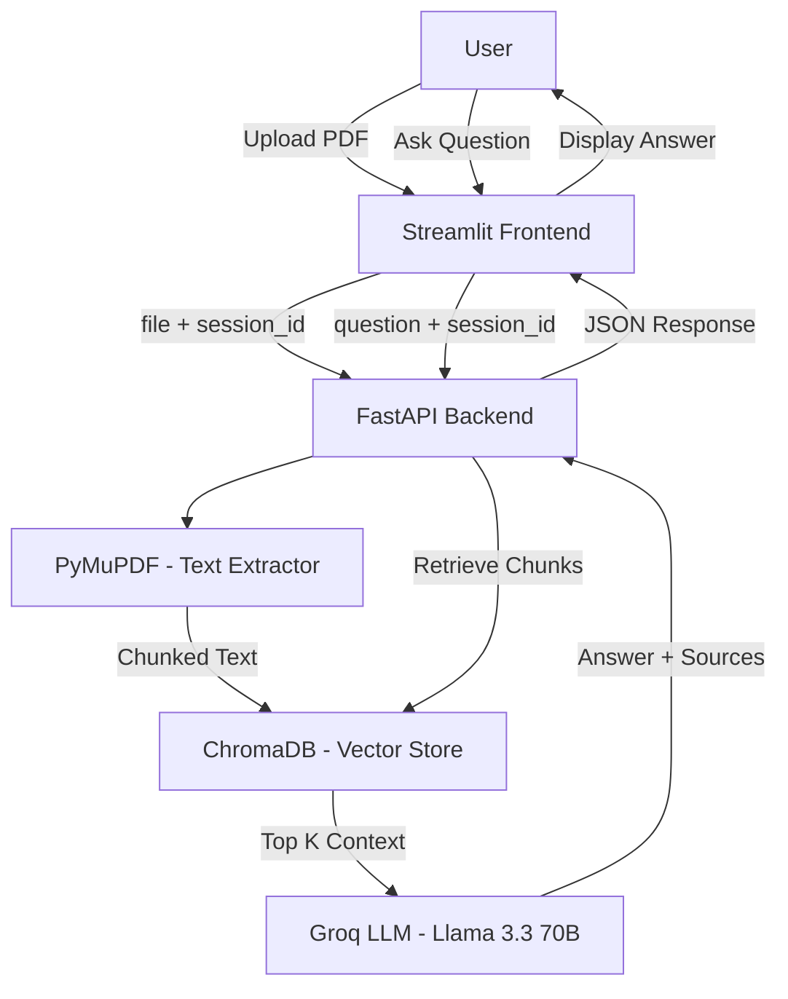

# 📚 AI Notes Assistant

A RAG app that lets you upload your college PDF notes and ask questions — powered by LLMs.

Upload your lecture slides, textbook chapters, or study materials. The AI reads, indexes, and answers your questions using **only** the content you provide — no hallucinations, just your notes.

---

## 🏗️ System Architecture



---

## 🛠️ Tech Stack

- **Frontend:** Streamlit
- **Backend:** FastAPI
- **PDF Parsing:** PyMuPDF
- **Chunking:** LangChain RecursiveCharacterTextSplitter
- **Vector DB:** ChromaDB
- **LLM:** Groq (Llama 3.3 70B)

---

## 🚀 Setup

```bash
# clone the repo
git clone https://github.com/PixelProgrammer4209/month-2-sprint-b-projects.git
cd month-2-sprint-b-projects

# create virtual env and install deps
python -m venv venv
source venv/bin/activate
pip install -r requirements.txt

# add your groq api key
echo 'GROQ_API_KEY="your_key_here"' > .env
```

Get a free Groq API key from [console.groq.com](https://console.groq.com/)

---

## ▶️ Run

You need two terminals:

```bash
# Terminal 1 - Backend
uvicorn main:app --reload
```

```bash
# Terminal 2 - Frontend
streamlit run app.py
```

Backend runs on `http://localhost:8000`, frontend on `http://localhost:8501`.

---

## 📂 Project Structure

```
├── main.py             # FastAPI entry point
├── api.py              # /upload and /query endpoints
├── processor.py        # PDF extraction + LLM answer generation
├── database.py         # ChromaDB operations
├── app.py              # Streamlit frontend
├── requirements.txt    # dependencies
└── .env                # API keys (not committed)
```

---

Built for **µLearn Month 2 Sprint B** 🚀
